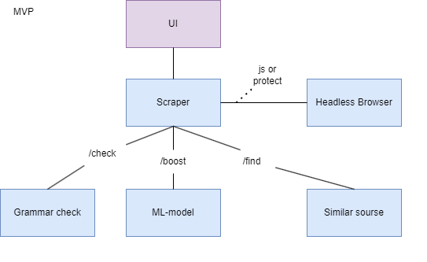

# TopicInsight

### Описание
Микросервисное приложение для определения тематики веб-ресурса

### Планируемая структура

- `scraper` - сервис извлечения данных
- `grammar cheker` - сервис для проверки написания
- `ML Model` - сервис определения тематики
- `Similar finder` - сервис поиска похожих сайтов

### Архитектура
#### MVP 1.0
